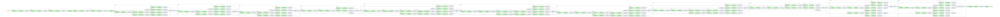
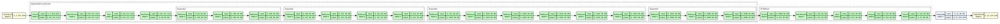
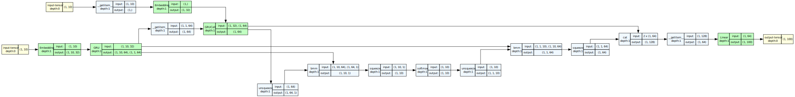
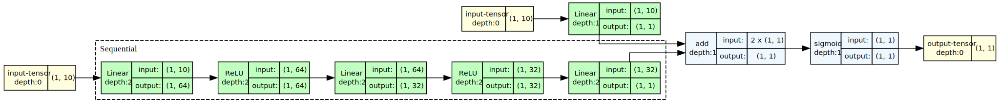
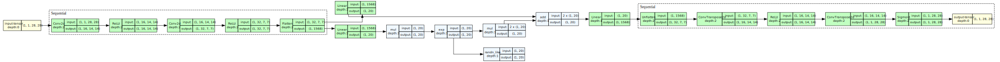

# Model Gallery

This page showcases visualizations of classic deep learning models generated using `torchview`.

All images are in **SVG vector format**. You can **click on any image** or **zoom in** your browser to view all details.

---

## 🖼️ Computer Vision

### ResNet-50

**Residual Network**: A classic CNN architecture that solves the training challenges of deep networks through skip connections. The Bottleneck structure is clearly shown in the visualization.

### Inception V3

**Inception Architecture**: Known for its multi-scale branches (Inception Modules), this architecture is both complex and efficient.

### Vision Transformer (ViT)

**ViT**: Applies the Transformer architecture directly to image patches, completely eliminating convolutional operations.

### FCN (Fully Convolutional Network)

**Fully Convolutional Network**: A classic model for semantic segmentation, built on a ResNet-50 backbone.

---

## 📝 Natural Language Processing (NLP)

### Transformer Encoder (BERT-style)

**Transformer Encoder**: Contains Multi-Head Attention and Feed Forward Network, serving as the foundation for models like BERT.

### Seq2Seq with Attention

**Sequence-to-Sequence with Attention**: A classic machine translation architecture. The visualization shows the Encoder (left) and Decoder (right) with the Attention computation process in between (horizontal layout).

---

## 🛒 Recommender Systems

### Wide & Deep

**Wide & Deep**: A classic recommendation architecture that combines linear models (Wide, for memorization) with deep neural networks (Deep, for generalization).

---

## 🎨 Generative Models

### VAE (Variational Autoencoder)

**Variational Autoencoder**: The visualization shows the complete generative pipeline: Encoder → Reparameterization (sampling) → Decoder.

---

## ⭐ Special Architectures

### WaveNet

**WaveNet**: A generative model for speech synthesis. The visualization clearly shows the stacked residual blocks based on dilated convolutions (horizontal layout).

### GCN (Graph Convolutional Network)

**Graph Convolutional Network**: A neural network for processing graph-structured data.

---

## How to Contribute

If you'd like to add new models to the gallery, please ensure:
1. The model architecture is representative.
2. Use `torchview` to generate SVG format for clarity.
3. Submit a PR to our repository.
